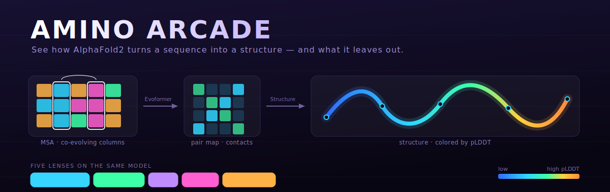
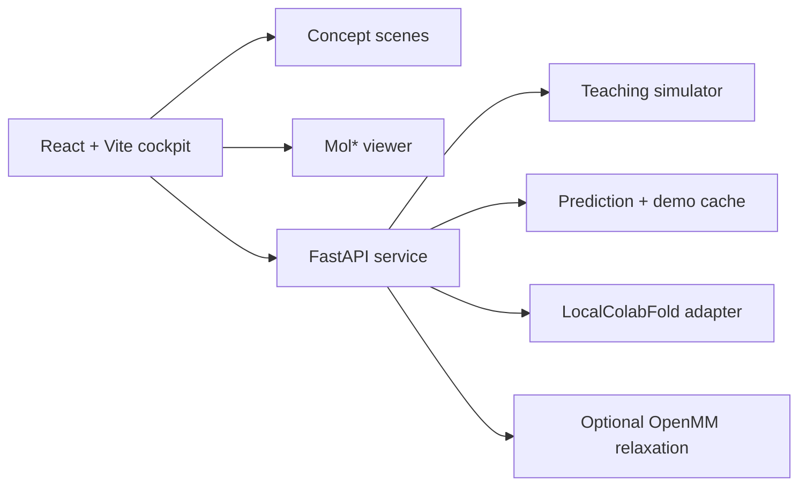

<div align="center">



# Amino Arcade

**A local-first workbench for learning how AlphaFold2 reasons about protein structure.**

[](https://github.com/yashgurbani/amino-arcade/actions/workflows/ci.yml)
[](https://react.dev/)
[](https://fastapi.tiangolo.com/)
[](https://molstar.org/)
[](LICENSE)

[Live demo](https://yashgurbani.github.io/amino-arcade/) · [Quick start](#quick-start) · [Learning lenses](#learning-lenses) · [Protein library](#protein-library) · [Inference engines](#inference-engines) · [Architecture](#architecture) · [Citations](#citation)

</div>

---

Amino Arcade is an interactive way to read the AlphaFold2 paper ([Jumper et al., 2021](#citation)). Ideas you normally meet as equations become scenes you can drive with sliders, shown next to real structures you can rotate and inspect.

It runs in the browser and works without a GPU using bundled results. When you want real predictions, it connects to local AlphaFold-family inference. Throughout, it keeps one rule: a teaching simulation is never dressed up as a biological prediction. Every structure on screen says where it came from.


## What you can do

- **Manipulate the geometry that makes the model work.** Toggle coevolution, triangle updates, invariant point attention, FAPE, chirality, and recycling on real and teaching structures.
- **Read a structure honestly.** Mol* renders each protein with pLDDT coloring, a PAE map, contacts, recycle frames, and click-to-highlight residues.
- **Start with zero install.** Bundled LocalColabFold results give you the full experience in demo mode, no Python backend required.
- **Run real inference when ready.** A guarded LocalColabFold adapter handles queued jobs, cancellation, logs, cache reuse, and reproducible run manifests.
- **Learn the vocabulary first.** A short Protein Basics path walks from amino acids to "what AlphaFold predicts and what it leaves out" before you touch the architecture.

## Learning lenses

Each lens isolates one idea from the paper and makes it something you can poke at rather than read about.

| Lens | The question it makes visible | Paper anchor |
| --- | --- | --- |
| **Coevolution** | When does a correlated pair of columns in the MSA imply a real residue contact, and when is it an indirect artifact? | MSA / outer product mean |
| **Triangle updates** | Why can't pairwise distances be edited one at a time? | Triangle multiplication / self-attention |
| **Invariant point attention** | How can geometric reasoning stay identical under global rotation and translation? | Algorithm 22 (IPA) |
| **FAPE & chirality** | Why can a mirror image keep every distance and still be wrong? | Supplement §1.9.2 (FAPE) |
| **Recycling** | How does repeated refinement converge, and why is it not folding in time? | Algorithm 2 (recycling) |

The "all five lenses" grand tour runs them together on a two-domain enzyme (adenylate kinase) where each one reads cleanly.

## Protein library

The curated tour is six targets, one per lens. Beyond that, a reference library pairs each protein with a specific lesson, including the cases where AlphaFold's honest answer is "I'm not sure."

| Protein | PDB | Why it's here |
| --- | --- | --- |
| Salivary amylase | 1SMD | A deep MSA, so coevolution turns correlated columns into a clear contact network |
| GFP | 1EMA | Run without an MSA on purpose: confidence stays low, a useful failure |
| Myoglobin | 1MBN | A compact helix bundle whose geometry reads the same from every angle (IPA) |
| Carbonic anhydrase | 1CA2 | Rigid β-core, mobile loops, right-handed helices (FAPE and chirality) |
| Phosphoglycerate kinase | 3PGK | A deliberately shallow MSA so recycling has visible work to do |
| Adenylate kinase | 4AKE | Two domains where every lens stays interpretable at once |
| Calmodulin | 1CLL | Two confident lobes, an uncertain hinge: read PAE, not just pLDDT |
| Ras GTPase | 5P21 | A confident core with flexible switch loops, and an omitted nucleotide |
| Ubiquitin | 1UBQ | The smallest clean, high-confidence fold |
| Alpha-synuclein | 1XQ8 | Intrinsically disordered: low pLDDT is the correct answer |
| Prion protein | 1QLX | One sequence with two fates; the disease conversion is invisible to a single prediction |
| p53 DNA-binding domain | 1TUP | A protein whose job is binding DNA, so the monomer fold omits the partner that defines it |
| HIV-1 protease | 1HSG | The active enzyme is a dimer; the monomer fold is fine but functionally incomplete |

A folded sequence is a single protein chain. Cofactors, metals, ligands, partner chains, and post-translational chemistry are not predicted, and each target says so in its scope note.

## Quick start

### Demo mode (no backend)

The fastest route uses bundled cached structures and skips Python entirely.

```powershell
cd frontend
npm ci
$env:VITE_DEMO_CACHE="1"
npm run dev
```

Open http://localhost:5173.

### Full local stack

Start the API:

```powershell
python -m pip install -r requirements-dev.txt
python -m uvicorn backend.app:app --host 127.0.0.1 --port 8011
```

In a second terminal, start the frontend pointed at it:

```powershell
cd frontend
npm ci
$env:VITE_API_BASE="http://127.0.0.1:8011"
npm run dev
```

The interactive API docs are at http://127.0.0.1:8011/docs.

## Inference engines

The backend exposes several engines behind one adapter boundary. They differ in what they actually compute, so each result is labeled accordingly.

| Engine | What it is | Scientific status |
| --- | --- | --- |
| Teaching simulator | Fast, deterministic concept exploration | Educational only; not a structure predictor |
| Bundled demo cache | Zero-install inspection of real saved outputs | Cached LocalColabFold artifacts with provenance |
| LocalColabFold | Optional local sequence-to-structure inference | Real AF2-family inference when configured |
| minAlphaFold2 | Paper-faithful architecture integration test | Architecture demonstration, not arbitrary pretrained inference |
| OpenMM relaxation | Energy-minimize an existing PDB | Post-processing only |

LocalColabFold runs best through WSL2 on Windows. Point `LOCALCOLABFOLD_BIN` at a command compatible with `colabfold_batch query.fasta output_dir`, then check the backend preflight endpoint before long jobs. See [docs/LOCAL_MODELS.md](docs/LOCAL_MODELS.md).

## Architecture



| Path | Responsibility |
| --- | --- |
| `frontend/src/components/` | Cockpit UI, Mol* viewer, plots, guided tour, onboarding, library |
| `frontend/src/data/` | Curated targets, concept definitions, paper grounding, scene specs |
| `frontend/src/lib/` | Pure concept math, analysis helpers, API clients, export metadata |
| `backend/` | API contracts, adapters, job queue, provenance, guardrails, physics |
| `frontend/public/demo-cache/` | Portable, inspectable prediction fixtures |
| `scripts/` | Setup, cache adoption, scaling, release, and verification utilities |

Design boundaries are written up in [docs/ARCHITECTURE.md](docs/ARCHITECTURE.md).

## Verification

Run the whole gate:

```powershell
powershell -ExecutionPolicy Bypass -File .\scripts\verify.ps1
```

Or each layer on its own:

```powershell
cd frontend
npm run lint
npm test -- --run
npm run build

cd ..
python -m pytest backend -q
```

## Scientific honesty and limits

- A prediction is one protein chain. Cofactors, metals, ligands, partner chains, and modifications are not modeled.
- pLDDT and PAE are confidence estimates, not free energies. Low confidence on a disordered region is a correct answer, not a bug.
- Recycle frames show representation refinement, not a physical folding trajectory in time.
- The teaching simulator is not a structure predictor. Only LocalColabFold runs produce research-grade hypotheses, and even those are hypotheses.
- Sequence input is capped (default 768 residues via `AF_COMPANION_MAX_SEQUENCE`); reference PDB fetches use an allowlist, size limit, timeout, and disk cache.

## Citation

This project is a teaching companion to, not a reimplementation of, AlphaFold2. If it helps your work, please cite the original paper and its Supplementary Information, which is the source for the algorithms the lenses visualize (IPA, FAPE, the triangle updates, and the recycling schedule).

> Jumper, J., Evans, R., Pritzel, A. et al. Highly accurate protein structure prediction with AlphaFold. *Nature* **596**, 583–589 (2021). https://doi.org/10.1038/s41586-021-03819-2
>
> Jumper, J. et al. Supplementary Information for "Highly accurate protein structure prediction with AlphaFold." *Nature* (2021). https://static-content.springer.com/esm/art%3A10.1038%2Fs41586-021-03819-2/MediaObjects/41586_2021_3819_MOESM1_ESM.pdf

```bibtex
@article{jumper2021alphafold,
  title   = {Highly accurate protein structure prediction with {AlphaFold}},
  author  = {Jumper, John and Evans, Richard and Pritzel, Alexander and others},
  journal = {Nature},
  volume  = {596},
  number  = {7873},
  pages   = {583--589},
  year    = {2021},
  doi     = {10.1038/s41586-021-03819-2}
}
```

Two tools this project depends on are worth citing too:

> Mirdita, M., Schütze, K., Moriwaki, Y. et al. ColabFold: making protein folding accessible to all. *Nature Methods* **19**, 679–682 (2022). https://doi.org/10.1038/s41592-022-01488-1
>
> Sehnal, D. et al. Mol* Viewer: modern web app for 3D visualization and analysis of large biomolecular structures. *Nucleic Acids Research* **49**, W431–W437 (2021). https://doi.org/10.1093/nar/gkab314

## Contributing

The smallest useful contributions are a new teaching scene (`frontend/src/data/sceneSpecs.js`), a tested geometry helper (`frontend/src/lib/`), or a curated target with a learning outcome (`frontend/src/data/targets.js`). See [CONTRIBUTING.md](CONTRIBUTING.md), [CODE_OF_CONDUCT.md](CODE_OF_CONDUCT.md), and [SECURITY.md](SECURITY.md).

## License

The Amino Arcade source is released under the [MIT License](LICENSE). Mol*, ColabFold, AlphaFold-derived tools, model weights, and external databases keep their own licenses and terms.

## Acknowledgements

Built on the work of the AlphaFold team at DeepMind, the ColabFold authors, and the Mol* developers. The pedagogy owes a lot to the AlphaFold2 Supplementary Information, which is far more readable than its length suggests.
